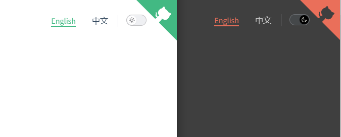

# Quick start

[](https://www.npmjs.com/package/docsify-dark-switch)
[](https://github.com/markz-demo/docsify-dark-switch/blob/main/LICENSE)
[](https://www.jsdelivr.com/package/npm/docsify-dark-switch)

> A [docsify](https://docsify.js.org) plugin which can add light and dark themes switching functionality to your docsify site.

[Documentation](https://markz-demo.github.io/docsify-dark-switch) - Demo, installation, options, and theme previews

## Screenshots



## Installation

```html
<!-- head -->
<!-- set theme stylesheet the corresponding title, you can set multiple  -->
<link rel="stylesheet" title="light" href="//cdn.jsdelivr.net/npm/docsify/themes/vue.css">
<link rel="stylesheet" title="dark" href="//cdn.jsdelivr.net/npm/docsify/themes/dark.css">

<!-- link docsify-dark-switch.css  -->
<link rel="stylesheet" href="//cdn.jsdelivr.net/npm/docsify-dark-switch/dist/docsify-dark-switch.css">

<!-- Also insert you custom css -->

<!-- body -->
<!-- script docsify-dark-switch.js or docsify-dark-switch.min.js  -->
<script src="//cdn.jsdelivr.net/npm/docsify-dark-switch/dist/docsify-dark-switch.min.js"></script>
```

This example uses the `docsify` official theme. You can also reference the theme css file you want, and you need to set the corresponding `title`. When switching the theme, the plugin will automatically switch the theme css file based on the `title`.

More `docsify` official themes: https://docsify.js.org/#/themes

### CDN

If the cdn reference cannot be referenced, you can choose another cdn below, or download it to a local reference.

- jsdelivr cdn: https://cdn.jsdelivr.net/npm/docsify-dark-switch/
- unpkg cdn: https://unpkg.com/browse/docsify-dark-switch/

## Configure

```html
<script>
window.$docsify = {
    // ...
    darkSwitch: {
        fixed: false,
        debug: false,
    },
    // ...
}
</script>
```

| Argument | Description                                                                                                                                           | Type      | Default                          |
| -------- | ----------------------------------------------------------------------------------------------------------------------------------------------------- | --------- | -------------------------------- |
| `fixed`  | Whether the switch button is fixed, that is, it is fixed in the upper right corner and does not scroll with the scroll bar. The default is not fixed. | `boolean` | `false`                          |
| `debug`  | Whether to enable debug mode, it is turned off by default.                                                                                            | `boolean` | `false`                          |
| `style`  | Set button style, which can be used to set button position and style.                                                                                 | `object`  | `{ top: '25px', right: '60px' }` |

## Remembering the themes switching

This plugin will remember the theme switching set. That means that when the browser is closed and then reopened, the theme switching will still be set. This is achieved via `localStorage`.