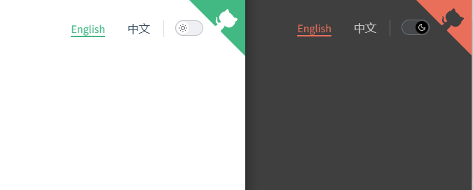

# 快速开始

[](https://www.npmjs.com/package/docsify-dark-switch)
[](https://github.com/markz-demo/docsify-dark-switch/blob/main/LICENSE)
[](https://www.jsdelivr.com/package/npm/docsify-dark-switch)

> 一个 [docsify](https://docsify.js.org) plugin，可以为您的 docsify 站点添加浅色和深色主题切换功能。

[Documentation](https://markz-demo.github.io/docsify-dark-switch) - Demo例子、安装、配置项、预览主题。

## 截图



## 安装

```html
<!-- head -->
<!-- 给 theme stylesheet 设置对应的 title，可以设置多个  -->
<link rel="stylesheet" title="light" href="//cdn.jsdelivr.net/npm/docsify/themes/vue.css">
<link rel="stylesheet" title="dark" href="//cdn.jsdelivr.net/npm/docsify/themes/dark.css">

<!-- 引用 docsify-dark-switch.css  -->
<link rel="stylesheet" href="//cdn.jsdelivr.net/npm/docsify-dark-switch/dist/docsify-dark-switch.css">

<!-- Also insert you custom css -->

<!-- body -->
<!-- 引用 docsify-dark-switch.js 或 docsify-dark-switch.min.js  -->
<script src="//cdn.jsdelivr.net/npm/docsify-dark-switch/dist/docsify-dark-switch.min.js"></script>
```

此例用的是 `docsify` 官方主题，也可以引用自己想要的主题css文件，同时需要设置对应的 `title`，当切换主题时，plugin内部会根据 `title` 自动切换主题css文件。

更多 `docsify` 官方主题：https://docsify.js.org/#/zh-cn/themes

### CDN

如果cdn引用无法引用，可以选择下面其它cdn，也可以download到本地引用。

- jsdelivr cdn: https://cdn.jsdelivr.net/npm/docsify-dark-switch/
- unpkg cdn: https://unpkg.com/browse/docsify-dark-switch/

## 配置项

```html
<script>
window.$docsify = {
    // ...
    darkSwitch: {
        fixed: false,
        debug: false,
    },
    // ...
}
</script>
```

| 属性    | 说明                                                             | 类型      | 默认值                           |
| ------- | ---------------------------------------------------------------- | --------- | -------------------------------- |
| `fixed` | 切换按钮是否固定，即固定在右上角，不随滚动条滚动，默认不是固定。 | `boolean` | `false`                          |
| `debug` | 是否开启debug调试模式，默认关闭。                                | `boolean` | `false`                          |
| `style` | 设置按钮style，可用来设置按钮位置及样式。                        | `object`  | `{ top: '25px', right: '60px' }` |

## 记住主题切换

这个 plugin 会记住切换的主题，意思是当关闭浏览器再重新打开后，主题会依然作用。这里是用 `localStorage` 实现的。
